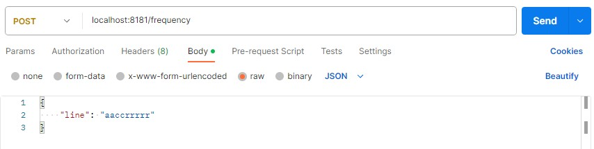

# Тестовое задание

Программа предназначена для получение частоты символов из входящей строки.

## Установка

### Клонирование проекта

git clone https://github.com/WoodyGray/test-task

### Запус jar файла проекта

Каталог где лежит jar файл: test-task\demo\target

Команда запуска: java -jar demo-0.0.1-SNAPSHOT.jar

## Использование

Проект запускается на localhost:8181

Пример POST запроса в Postman:


Ответ для запроса выше:


## Документация API

### LineController

Контроллер предназначен для определения частоты символов у входящей строки

Он имеет всего один метод:
	```java
	public ResponseEntity<?> getLineFrequency(@RequestBody LineRequest request)
	```

Так же есть поле сервиса:
	```java
	private final LineService service;
	```

### getLineFrequency

Метод для получения частоты символов во входящей строке

Метод: POST

Путь: /frequency

Тело запроса (Request Body):

```json
{
  "line": "aaabbbccr"
}```

Тело ответа (Response Body):

```json
{
  "frequency": {
    "a": 3,
    "b": 3,
    "c": 2,
    "r": 1
  }
}```

### service

Поле предназначено для делегирования логики вычисления частоты, чтобы не награмождать сам контроллер, что поможет при масштабировании проекта.

## Контакты

Оставлю свою почту для вопросов:
	leonidrozanow228@gmail.com


## Сборка и запуск проекта

Инструкции по сборке и запуску проекта.

## Часто задаваемые вопросы (FAQ)

Ответы на часто задаваемые вопросы.

## Бейджи

[](https://shields.io/)
[](https://shields.io/)
[](https://shields.io/)

## Тесты

Отчет jacoco вы можете найти в следующем каталоге: test-task\demo\target\site\jacoco\index.html
